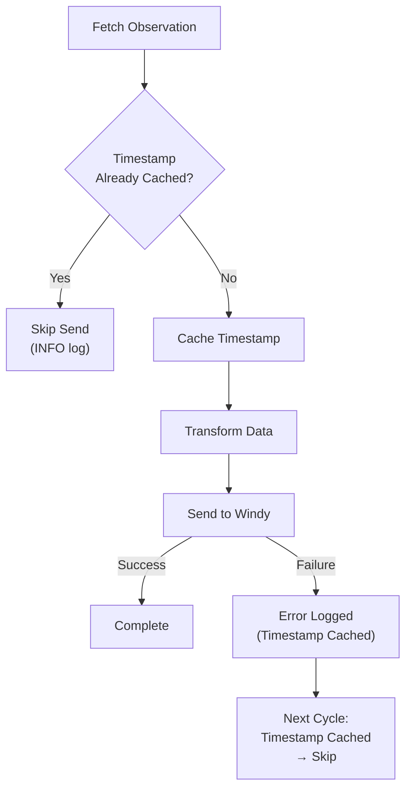
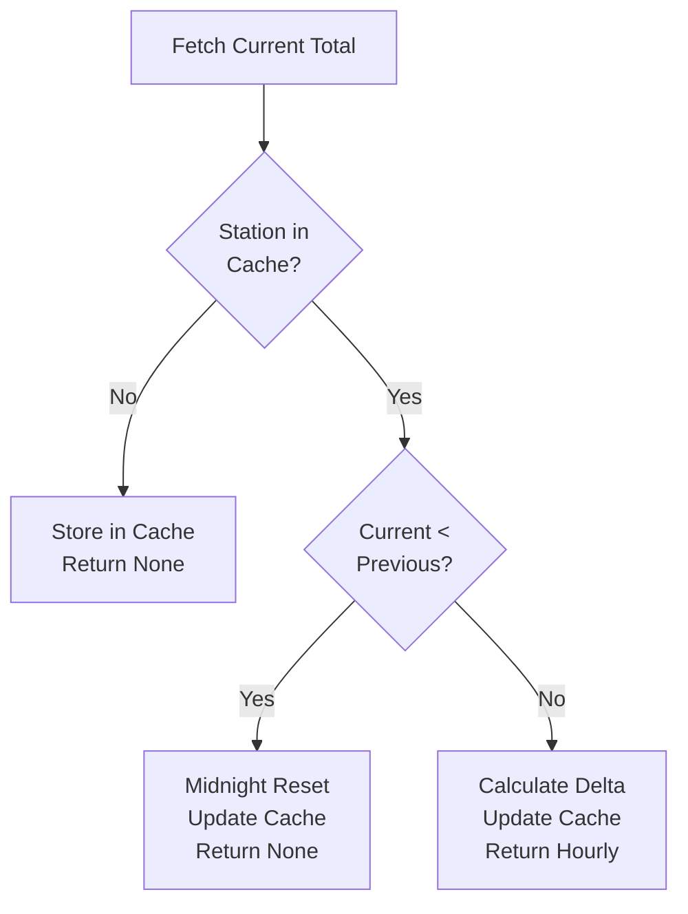

# Architecture Documentation

## Design Philosophy

This application follows **functional composition** principles instead of object-oriented programming, adhering to DRY (Don't Repeat Yourself) and KISS (Keep It Simple, Stupid) principles.

## Core Principles

### 1. Functional Composition

- Functions as the primary unit of organization
- Pure functions where possible
- Explicit dependencies passed as parameters
- No hidden state or side effects

### 2. DRY (Don't Repeat Yourself)

- Reusable functions across modules
- Configuration centralized in one place
- Common patterns extracted (retry logic, error handling)

### 3. KISS (Keep It Simple, Stupid)

- Straightforward data flow
- Minimal abstractions
- Clear function signatures
- Direct error handling

## Module Organization

```text
weatherstationdatabridge/
├── models.py          # Domain models and exceptions
├── config.py          # Configuration loading
├── wu_client.py       # Weather Underground API (raw data fetch)
├── transformer.py     # ALL data transformations (wind, precipitation, UV)
├── windy_client.py    # Windy API
├── retry.py           # Retry logic
├── orchestrator.py    # Sync orchestration
├── scheduler.py       # Task scheduling
├── health.py          # Health monitoring
└── __init__.py        # CLI entry point
```

## Data Flow

```text
1. Configuration Loading (config.py)
   └─> Environment Variables → Configuration object

2. Scheduler Loop (scheduler.py)
   └─> Every N minutes → Execute Sync Cycle

3. Sync Cycle (orchestrator.py)
   ├─> For each station (concurrent, max 2):
   │   ├─> Fetch Raw WU Data (wu_client.py)
   │   ├─> Check Last Sent Timestamp (deduplication)
   │   ├─> Transform Data: Convert Wind + Track Precipitation + Convert UV (transformer.py)
   │   └─> Send to Windy with Retry (windy_client.py + retry.py)
   └─> Return Sync Results

4. Health Monitoring (health.py)
   └─> HTTP endpoint → Check last sync status
```

## Function Composition Example

Instead of classes with methods, we compose functions:

```python
# Configuration
config = load_configuration()

# Create specialized functions
sync_executor = create_sync_executor(config)

# Compose into scheduler
run_scheduler(sync_executor, config.sync_interval_minutes)
```

## Error Handling Strategy

### Layered Error Handling

1. **API Client Level**: Raise specific exceptions

   - `APIConnectionError`
   - `AuthenticationError`
   - `StationNotFound`
   - `RateLimitExceeded`

2. **Retry Level**: Handle transient errors

   - Exponential backoff
   - Max attempts limit
   - Raises `MaxRetriesExceeded`

3. **Orchestrator Level**: Catch all errors

   - Continue on single station failure
   - Log errors
   - Return `SyncResult` with error details

4. **Scheduler Level**: Keep running
   - Log exceptions
   - Wait before retry
   - Never crash service

## Timestamp Deduplication

To prevent duplicate API submissions and unnecessary warnings, the orchestrator maintains an in-memory cache of observation timestamps per station.

### Mechanism

```python
_last_sent_timestamps: dict[str, datetime] = {}

# Check if timestamp already seen
if _last_sent_timestamps.get(station_id) == observation.timestamp:
    logger.info(f"Skipping station {station_id}: observation already sent")
    return  # Skip sending

# Mark timestamp as seen BEFORE attempting send
# This prevents retrying the same timestamp on failure
_last_sent_timestamps[station_id] = observation.timestamp

# ... transform and send ...
```

### Key Behavior

**Timestamps are cached BEFORE the send attempt**, not after. This ensures:

1. **First encounter**: Cache timestamp → attempt send
2. **If send succeeds**: No retry needed (already cached)
3. **If send fails**: Timestamp already cached → won't retry same observation
4. **Next cycle**: Same timestamp detected → skipped with INFO log
5. **New data**: New timestamp → attempt send

This prevents wasting retry attempts on observations that will never succeed (e.g., "timestamp already present" errors from Windy).

### Benefits

- **Prevents duplicate warnings**: Eliminates "timestamp already present" errors from Windy API
- **Reduces wasted retries**: Doesn't retry observations that already failed
- **Handles stale data gracefully**: Weather stations with slow reporting (15+ min intervals) are handled efficiently
- **Simple & stateless**: No persistence needed; acceptable to resend after app restart

### Deduplication Flow



## Precipitation Tracking

Weather Underground provides **daily cumulative precipitation totals**, but Windy expects **hourly precipitation**. The transformer maintains an in-memory cache to calculate hourly deltas.

### Mechanism

```python
_precipitation_cache: dict[str, tuple[datetime, Optional[float], Optional[float]]] = {}

def calculate_hourly_precipitation(station_id, current_timestamp, current_precip_mm, current_precip_in):
    # First reading: store and return None
    if station_id not in _precipitation_cache:
        _precipitation_cache[station_id] = (current_timestamp, current_precip_mm, current_precip_in)
        return None, None

    # Get previous values
    prev_timestamp, prev_mm, prev_in = _precipitation_cache[station_id]

    # Detect midnight reset (daily total decreases)
    if current_precip_mm < prev_mm:
        _precipitation_cache[station_id] = (current_timestamp, current_precip_mm, current_precip_in)
        return None, None  # Conservative: skip after reset

    # Calculate hourly delta
    hourly_mm = current_precip_mm - prev_mm
    hourly_in = current_precip_in - prev_in

    # Update cache and return
    _precipitation_cache[station_id] = (current_timestamp, current_precip_mm, current_precip_in)
    return hourly_mm, hourly_in
```

### Benefits

- **Accurate hourly data**: Converts daily totals to hourly precipitation
- **Midnight reset detection**: Handles daily counter reset gracefully
- **Per-station tracking**: Independent history for each weather station
- **Simple & stateless**: In-memory cache, acceptable to reset on restart
- **Conservative approach**: Returns None for first reading and after midnight reset

### Precipitation Calculation Flow



## Data Quality Transformations

All data quality transformations happen in `transformer.py` for consistency and maintainability.

### Wind Speed Conversion

Weather Underground's metric API returns wind speeds in **km/h**, but Windy expects **m/s**.

```python
# In transformer.py
wind_speed_mps = None
if observation.wind_speed_kmh is not None:
    wind_speed_mps = observation.wind_speed_kmh / 3.6

wind_gust_mps = None
if observation.wind_gust_kmh is not None:
    wind_gust_mps = observation.wind_gust_kmh / 3.6
```

**Conversion factor**: 1 m/s = 3.6 km/h
**Location**: `transformer.py` (alongside other transformations)

### UV Index Conversion

Windy expects UV index as an **integer**, but Weather Underground provides a **float**.

```python
# In transformer.py
uv_value = None
if observation.uv_index is not None:
    uv_value = int(observation.uv_index)  # Truncate to integer
```

**Location**: `transformer.py` (alongside other transformations)

## Concurrency Model

### AsyncIO for I/O Operations

```python
async def sync_station(...):
    # Fetch (I/O bound)
    observation = fetch_weather_underground_data(...)

    # Transform (CPU bound, but fast)
    windy_obs = transform_to_windy_format(...)

    # Send with retry (I/O bound)
    await retry_with_backoff(...)
```

### Semaphore for Rate Limiting

```python
semaphore = asyncio.Semaphore(2)  # Max 2 concurrent

async def sync_with_semaphore(...):
    async with semaphore:
        return await sync_station(...)
```

## Configuration as Code

All behavior controlled by environment variables:

```python
config = Configuration(
    windy_api_key="...",
    wu_api_key="...",
    wu_station_ids=["KSTATION1", "KSTATION2"],
    windy_station_ids=["0", "1"],
    sync_interval_minutes=5,
    retry_attempts=3,
    retry_delay_seconds=5,
)
```

## Testing Strategy

### Unit Tests

- Test individual functions
- Mock external dependencies
- Test error conditions
- Verify data transformations (wind speed, precipitation, UV index)

**Test Coverage (30 tests):**

- Configuration tests (7 tests)
- Model validation (4 tests)
- Transformer tests (3 tests)
- Bug fix verification (5 tests)
- Precipitation tracking (11 tests)

### Integration Tests

- Use `test-sync` command
- Test with real (or mocked) APIs
- Verify end-to-end flow

### Data Quality Tests

- **Wind speed conversion**: Verify km/h → m/s (÷ 3.6)
- **Precipitation tracking**: Test first reading, normal increase, midnight reset, edge cases
- **UV index**: Verify float → integer conversion

## Performance Characteristics

### Memory Usage

- Minimal state storage
- Streaming data processing
- Station metadata cached
- Timestamp deduplication (~50 bytes per station)
- Precipitation tracking cache (~100 bytes per station)
- **Target**: <128MB

### CPU Usage

- Mostly I/O bound (network)
- Async prevents blocking
- Idle between syncs
- **Target**: <0.5 cores

### Network

- Connection pooling (httpx)
- Concurrent requests (asyncio)
- Automatic retries
- **Target**: <1MB/min total

## Deployment Considerations

### Docker Container

- Python 3.11 slim base
- UV for fast dependency install
- Health check on port 8080
- Graceful shutdown handling

### Environment Variables

- All configuration via ENV
- No files to mount (except logs)
- Secrets in ENV (not in code)

### Monitoring

- Health check endpoint
- Structured logging
- Sync result tracking

## Extension Points

### Adding New Data Sources

1. Create new client module (e.g., `accuweather_client.py`)
2. Implement fetch function
3. Add to orchestrator

### Adding New Destinations

1. Create new client module (e.g., `weatherapi_client.py`)
2. Implement send function
3. Add to orchestrator

### Custom Transformations

1. Add transformer function
2. Compose in orchestrator
3. Test with unit tests

## Why No OOP?

### Problems with OOP for this use case

- **Unnecessary abstraction**: No complex state to encapsulate
- **Hidden dependencies**: Methods access instance variables
- **Testing complexity**: Mocking objects harder than functions
- **Cognitive overhead**: Understanding class hierarchies

### Benefits of functional approach

- **Explicit dependencies**: All inputs are parameters
- **Easy testing**: Mock functions, not objects
- **Simple composition**: Functions compose naturally
- **Clear data flow**: Input → Transform → Output

## Comparison

### OOP Approach - What we avoided

```python
class WeatherSyncService:
    def __init__(self, config):
        self.config = config
        self.wu_client = WUClient(config.wu_api_key)
        self.windy_client = WindyClient(config.windy_api_key)

    def sync_station(self, station_id):
        # Hidden dependencies on self.config, self.wu_client, etc.
        pass
```

### Functional Approach - What we use

```python
def sync_station(station_id, wu_api_key, windy_api_key, ...):
    # All dependencies explicit as parameters
    observation = fetch_weather_underground_data(wu_api_key, station_id)
    windy_obs = transform_to_windy_format(observation, ...)
    send_to_windy(windy_api_key, windy_obs)
```

## Conclusion

This architecture achieves:

- ✅ **Simplicity**: Easy to understand and modify
- ✅ **Testability**: Pure functions are easy to test (30 tests covering all data transformations)
- ✅ **Reliability**: Explicit error handling at every level
- ✅ **Performance**: Async I/O with controlled concurrency
- ✅ **Maintainability**: Small, focused modules
- ✅ **Deployability**: Containerized with health checks
- ✅ **Data Quality**: Accurate unit conversions and precipitation tracking with comprehensive validation
