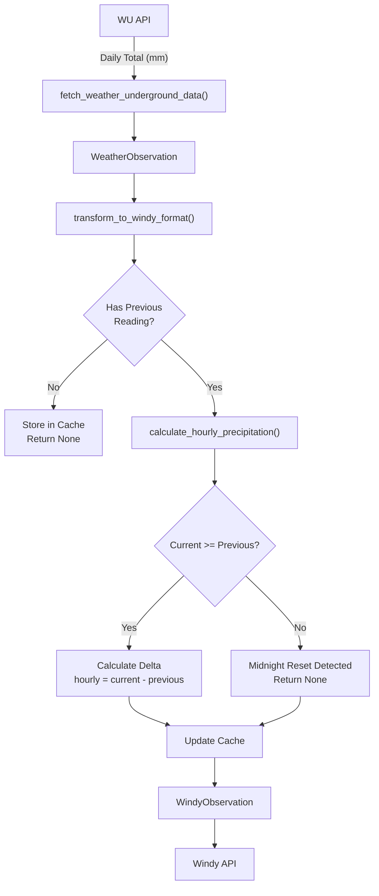
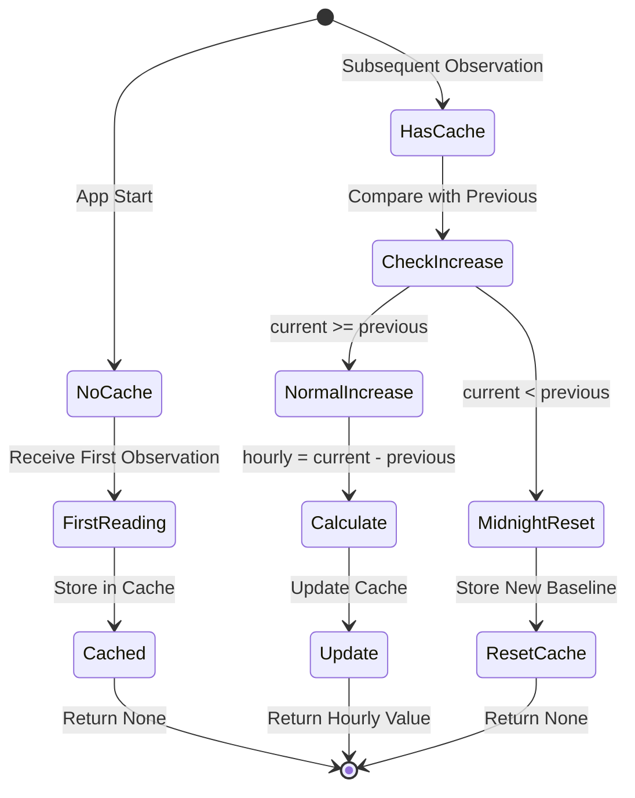

# Precipitation Tracking System

## Overview

This document explains how the precipitation tracking system works to convert Weather Underground's daily cumulative totals into Windy's hourly precipitation format.

---

## Architecture



---

## Data Flow

### Step 1: Fetch Data from WU

```
Weather Underground API Returns:
{
  "precipTotal": 15.0  // Daily cumulative (mm)
}
```

### Step 2: Transform to Windy Format

The transformer calls `calculate_hourly_precipitation()` with:
- `station_id`: Unique station identifier
- `current_timestamp`: Current observation time
- `current_precip_mm`: Current daily total (15.0mm)
- `current_precip_in`: Current daily total (0.59in)

### Step 3: Calculate Hourly Delta

```python
# Cache stores: {station_id: (timestamp, precip_mm, precip_in)}
previous = _precipitation_cache.get(station_id)

if previous is None:
    # First reading - store and return None
    _precipitation_cache[station_id] = (timestamp, 15.0, 0.59)
    return None, None

prev_timestamp, prev_precip_mm, prev_precip_in = previous

if current_precip_mm >= prev_precip_mm:
    # Normal case: calculate hourly delta
    hourly_mm = current_precip_mm - prev_precip_mm  # 15.0 - 10.0 = 5.0mm
    hourly_in = current_precip_in - prev_precip_in  # 0.59 - 0.39 = 0.20in
else:
    # Midnight reset: daily total reset to 0
    # Return None to be conservative
    return None, None
```

---

## State Transitions



---

## Example Scenarios

### Scenario 1: Normal Day (No Rain)

| Time  | Daily Total | Previous | Hourly Calc        | Result    |
|-------|-------------|----------|--------------------|-----------|
| 09:00 | 0.0mm       | -        | First reading      | None      |
| 10:00 | 0.0mm       | 0.0mm    | 0.0 - 0.0          | 0.0mm     |
| 11:00 | 0.0mm       | 0.0mm    | 0.0 - 0.0          | 0.0mm     |

### Scenario 2: Rainy Day

| Time  | Daily Total | Previous | Hourly Calc        | Result    |
|-------|-------------|----------|--------------------|-----------|
| 10:00 | 2.0mm       | -        | First reading      | None      |
| 11:00 | 5.0mm       | 2.0mm    | 5.0 - 2.0          | 3.0mm ✓   |
| 12:00 | 15.0mm      | 5.0mm    | 15.0 - 5.0         | 10.0mm ✓  |
| 13:00 | 15.0mm      | 15.0mm   | 15.0 - 15.0        | 0.0mm     |

### Scenario 3: Midnight Reset

| Time        | Daily Total | Previous | Hourly Calc        | Result         |
|-------------|-------------|----------|--------------------|----------------|
| 23:00       | 25.0mm      | -        | First reading      | None           |
| 00:00 (next)| 27.0mm      | 25.0mm   | 27.0 - 25.0        | 2.0mm ✓        |
| 01:00       | 28.0mm      | 27.0mm   | 28.0 - 27.0        | 1.0mm ✓        |
| **Midnight**| **2.0mm**   | 28.0mm   | 2.0 < 28.0 (reset) | None (detect)  |
| 01:00       | 3.0mm       | 2.0mm    | 3.0 - 2.0          | 1.0mm ✓        |

---

## Cache Structure

```python
_precipitation_cache = {
    "STATION_A": (
        datetime(2025, 10, 15, 12, 0, 0),  # Last observation time
        15.0,                               # Last daily total (mm)
        0.59                                # Last daily total (in)
    ),
    "STATION_B": (
        datetime(2025, 10, 15, 11, 30, 0),
        8.0,
        0.31
    )
}
```

---

## Edge Cases Handled

### 1. First Reading (No Previous Data)
**Behavior:** Return None
**Reason:** Cannot calculate delta without previous value

### 2. Missing Precipitation Data
**Behavior:** Return None
**Reason:** Cannot calculate if current or previous is None

### 3. Midnight Reset Detection
**Behavior:** Return None when current < previous
**Reason:** Daily total reset to 0, unclear time period for current reading

### 4. Zero Precipitation
**Behavior:** Return 0.0
**Reason:** No rain since last reading (valid measurement)

### 5. Very Small Increase (0.1mm)
**Behavior:** Calculate and return 0.1mm
**Reason:** Valid light drizzle measurement

### 6. Large Storm (100mm/hour)
**Behavior:** Calculate and return 100mm
**Reason:** Extreme but physically possible (heavy thunderstorm)

### 7. Multiple Stations
**Behavior:** Track each station independently
**Reason:** Different locations may have different precipitation patterns

### 8. Application Restart
**Behavior:** Cache cleared, all stations behave as first reading
**Reason:** In-memory cache, no persistence

---

## API Functions

### calculate_hourly_precipitation()

```python
def calculate_hourly_precipitation(
    station_id: str,
    current_timestamp: datetime,
    current_precip_mm: Optional[float],
    current_precip_in: Optional[float],
) -> tuple[Optional[float], Optional[float]]:
    """
    Calculate hourly precipitation from daily cumulative total.

    Returns:
        (hourly_mm, hourly_in) or (None, None)
    """
```

**Returns:**
- `(None, None)`: First reading, midnight reset, or missing data
- `(0.0, 0.0)`: No precipitation since last reading
- `(value, value)`: Calculated hourly precipitation

### clear_precipitation_cache()

```python
def clear_precipitation_cache() -> None:
    """Clear precipitation cache. Useful for testing or maintenance."""
```

**Use Cases:**
- Testing: Reset state between test cases
- Maintenance: Clear cache if station IDs change
- Manual reset: If incorrect data was cached

---

## Testing

See `tests/test_precipitation_tracking.py` for comprehensive tests:

- ✅ First reading returns None
- ✅ Normal precipitation increase
- ✅ No precipitation (zero change)
- ✅ Midnight reset detection
- ✅ Multiple stations tracked separately
- ✅ None value handling
- ✅ Cache clearing
- ✅ Integration with transformer
- ✅ Realistic sequence of readings
- ✅ Edge case: very small increase (0.1mm)
- ✅ Edge case: large accumulation (100mm)

---

## Design Decisions

### Why In-Memory Cache?

**Pros:**
- Simple implementation (KISS principle)
- Fast access (no I/O overhead)
- No external dependencies
- Automatic cleanup on restart

**Cons:**
- Lost on application restart
- Not persistent across deployments

### Why Return None on Midnight Reset?

**Conservative Approach:**
- After reset, we don't know exact time period for current reading
- Better to send no data than potentially incorrect hourly value
- Next reading will have correct baseline

**Alternative Considered:**
- Use current value as hourly (assumes reset just happened)
- Rejected: Too many assumptions about timing

### Why Per-Station Tracking?

**Reason:**
- Different stations may be in different time zones
- Different local weather patterns
- Independent precipitation events
- Supports multiple simultaneous stations

---

## Limitations

1. **First Reading:** Returns None (no historical context)
2. **Midnight Reset:** Returns None (conservative approach)
3. **App Restart:** Cache cleared, all stations reset
4. **Memory Only:** No disk persistence
5. **Time Assumptions:** Assumes readings are roughly hourly intervals

---

## Future Enhancements (Optional)

1. **Persistent Cache:** Save to disk for app restarts
2. **Database Storage:** Track full precipitation history
3. **Smart Reset:** Estimate hourly value after midnight reset
4. **Time-Weighted Calculation:** Account for irregular reading intervals
5. **Validation:** Cross-check with extreme precipitation thresholds

---

## Integration

The precipitation tracking is automatically used in the transformer:

```python
from weatherstationdatabridge.transformer import (
    transform_to_windy_format,
    clear_precipitation_cache,
)

# Transform observation (automatically calculates hourly precipitation)
windy_obs = transform_to_windy_format(weather_obs, station_index=0)

# Clear cache if needed (testing, maintenance)
clear_precipitation_cache()
```

---

## Monitoring Recommendations

1. **Log First Readings:** Monitor when stations return None (expected behavior)
2. **Log Midnight Resets:** Track daily reset detections for each station
3. **Alert on Extremes:** Flag hourly precipitation > 50mm for review
4. **Track Cache Size:** Monitor number of stations in cache
5. **Compare with WU:** Periodically verify daily totals match WU data

---

**Implementation:** Following DRY and KISS principles - simple functions, no OOP, minimal dependencies.

